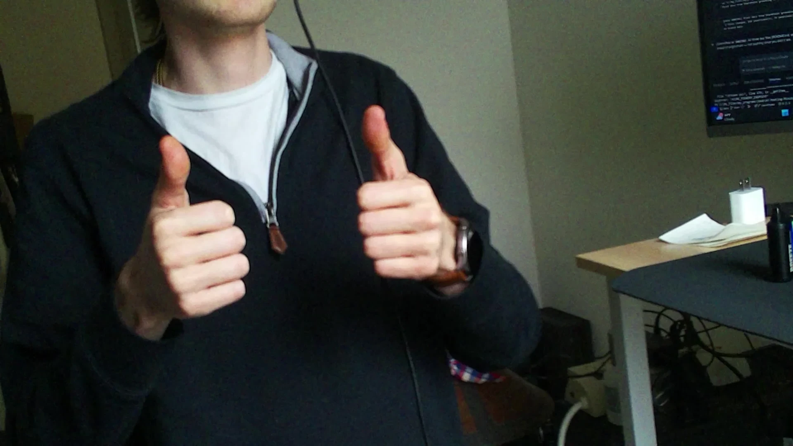
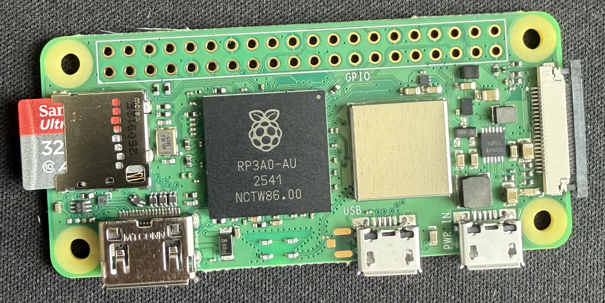
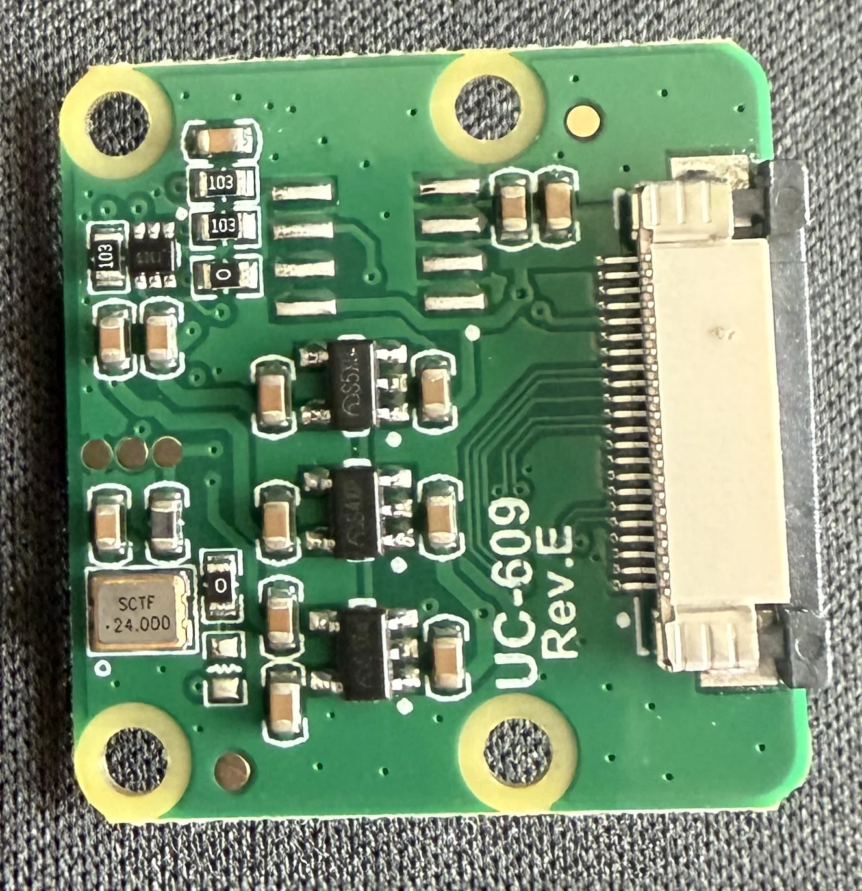
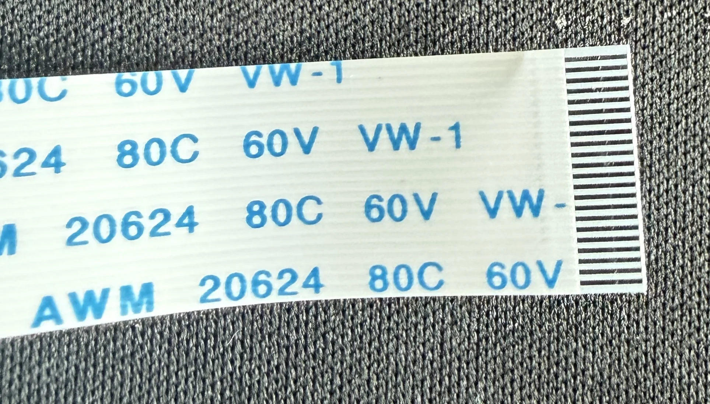
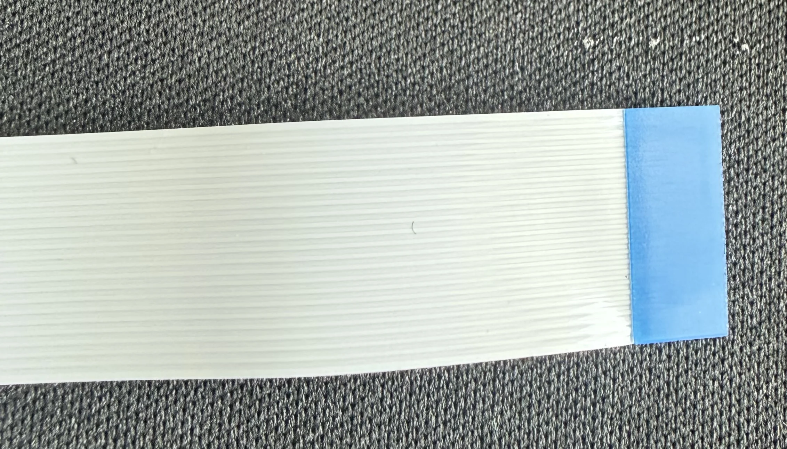
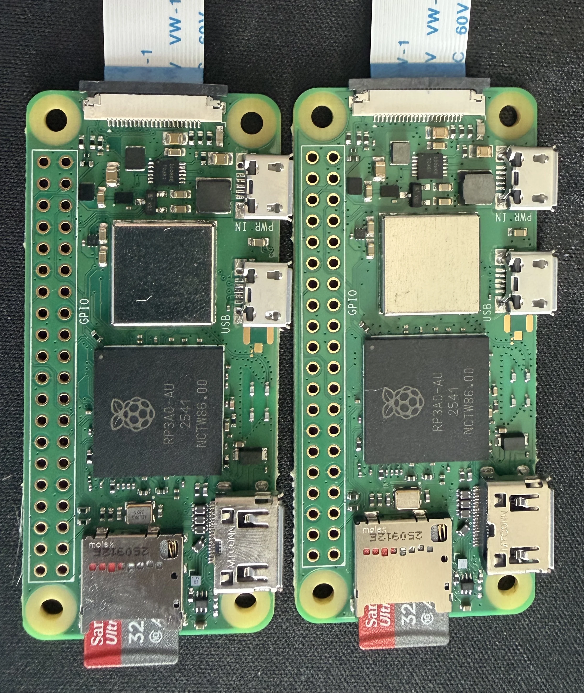
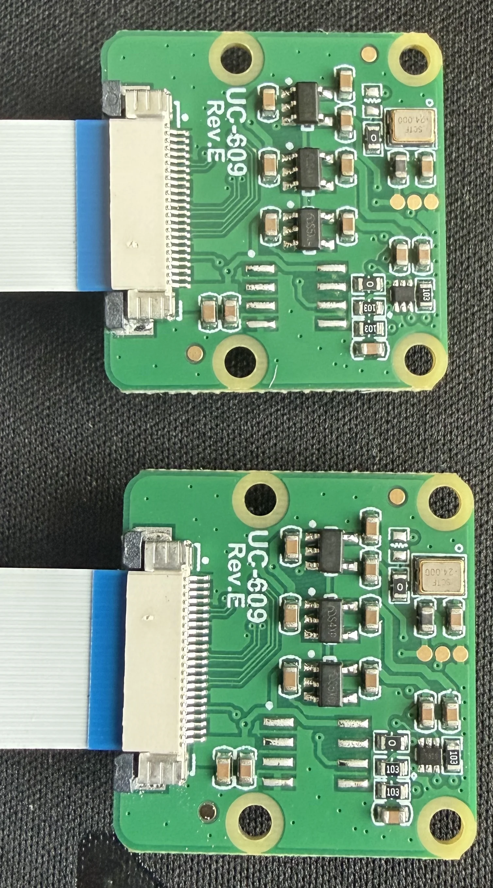

# security-cam-setup

DIY Wi-Fi security camera system. Cheap, stateless Pi-based camera nodes stream
RTSP/H.264 to a single old PC running Frigate as the NVR. All storage, motion
detection, and UI lives on the mothership — camera nodes are replaceable.


|  |  |
|---|---|
| Cam 1 snapshot | Cam 2 snapshot |

## Architecture

```
[Cam Node 1] --Wi-Fi/RTSP--> \
[Cam Node 2] --Wi-Fi/RTSP-->  --> [Mothership PC: Frigate + HDD]
[Cam Node N] --Wi-Fi/RTSP--> /
```

Edge nodes: capture + stream. Mothership: record, retain, view, manage.

### Design principles

- One sensor, one compute platform across all nodes (easy to mass-produce later).
- No hard drives at the edge. Storage lives centrally.
- Edge nodes are stateless — replace one by flashing an SD card.
- Push complexity into software on the mothership, not into each node.
- RTSP/H.264, not MJPEG. Wi-Fi bandwidth matters once you have 3+ cameras.

## Hardware

### Per camera node (v1 — ~$57)

| Part | Choice | Notes | Price (USD) | Buy |
|---|---|---|---|---|
| Compute | Raspberry Pi Zero 2 W | Built-in 2.4 GHz Wi-Fi, CSI-2, H.264 encode @ 1080p30 | $16.35 | [Canakit](https://www.canakit.com/raspberry-pi-zero-2-w.html?defpid=4783) |
| Camera | Arducam IMX219 8MP (Pi Camera V2 equivalent) | Ships with 22-22pin Zero 2W ribbon in the box. Upgrade to Camera Module 3 NoIR only on nodes that need night vision. | $12.99 | [Amazon](https://www.amazon.com/gp/product/B09V576TFN/ref=ox_sc_act_title_1?smid=A2IAB2RW3LLT8D&psc=1) |
| Storage | 32 GB SanDisk Ultra microSDHC (A1, 2-pack) | OS + app only, no footage | ~$16 (= $32 / 2) | [Amazon](https://www.amazon.com/gp/product/B08J4HJ98L/ref=ox_sc_act_title_2?smid=ATVPDKIKX0DER&th=1) |
| Power | Canakit 5V 2.5A Micro USB supply | Cheap bricks cause instability | $9.95 | [Canakit](https://www.canakit.com/raspberry-pi-adapter-power-supply-2-5a.html) |
| CSI cable | Zero 22-22pin ribbon | **Included with the Arducam camera above** — don't buy separately | $0 | — |
| Enclosure | 3D printed, 2-piece, PETG/ASA | ~40–60 g filament per unit | ~$2 (filament) | self-print |
| Optional | IR LED ring + light sensor | Only for NoIR night-vision units | ~$5 | — |
| **Per-node total** | | | **~$57 (day)** | |

### Mothership (reuse what you have)

| Part | Choice | Price (USD) |
|---|---|---|
| PC | Any old desktop / mini PC you already own | $0 |
| OS | Linux (Debian / Ubuntu LTS) | $0 |
| Storage | Surveillance-rated HDD (WD Purple / Seagate Skyhawk), 4–8 TB if buying new | ~$90–$180 (4–8 TB) / $0 if reusing |
| Network | Wired Gigabit Ethernet to the router (critical — don't put the NVR on Wi-Fi) | $0 |
| Optional | Google Coral USB TPU (for object detection in Frigate) | ~$60 |

### Network

- 5 GHz capable access point (even though Zero 2 W is 2.4 GHz only, this keeps the 2.4 band less congested for the cameras)
- Budget ~2–4 Mbps per 1080p camera
- Put cameras on a dedicated VLAN/SSID if your router supports it

## Software

### Edge node (per camera)

```
libcamera / rpicam-vid       -->    RTSP stream
  |
  v
MediaMTX (RTSP server)  ----------> rtsp://<cam-ip>:8554/cam
                                    (H.264, 1080p30, 2 Mbps)
FastAPI control API  --------------> http://<cam-ip>:8000
  - GET  /health          uptime, temp, free disk
  - GET  /snapshot         grab a JPEG frame
  - POST /stream/restart   restart mediamtx
  - POST /reboot           reboot the Pi
  - POST /settings         update resolution/fps/bitrate
systemd (auto-restart both services)
```

- **OS:** Raspberry Pi OS Lite (64-bit, Trixie / Debian 13)
- **RTSP server:** [MediaMTX](https://github.com/bluenviron/mediamtx) — small Go binary, uses the native `rpiCamera` source (hardware H.264, no ffmpeg pipe)
- **Control API:** FastAPI + uvicorn (small Python service)
- **Process management:** systemd (one unit per service, `Restart=always`)

### Mothership

- **NVR:** [Frigate](https://frigate.video/) in Docker — handles recording, retention, live view, motion/object detection, clip export
- **Reverse proxy (optional):** Caddy or nginx for HTTPS on your LAN
- **Monitoring (optional):** Uptime Kuma pinging each node's `/health`

## Setup

### Phase 0 — Hardware Assembly

Connect the CSI ribbon cable between the Pi Zero 2 W and the Arducam IMX219.

**Parts:**

| Pi Zero 2 W | Arducam IMX219 (back) | CSI ribbon cable |
|---|---|---|
|  |  |  |

**Cable orientation:**
- The cable has two sides: a **contacts side** (exposed metal strips) and a **plain side** (white/blue stiffener tab).
- Both the Pi and the Arducam have a small plastic CSI connector with a flip-up latch.

| |  |  |
|---|---|---|
| | Contacts side (metal strips) | Plain side (blue stiffener tab) |

**Steps:**
1. Gently flip up the plastic latch on the Pi's CSI connector (near the HDMI port).
2. Slide the ribbon cable in with **contacts facing the board** (toward the PCB).
3. Press the latch back down to lock.
4. Repeat on the Arducam — flip latch, insert cable with **contacts facing AWAY from the board** (opposite of the Pi side), close latch.
5. Insert the microSD card into the Pi's card slot.

**Result:**

| Assembled nodes |
|---|
|  |
|  |

### Phase 1 — Flash the SD Card

#### First time (needs internet)

1. Download and install [Raspberry Pi Imager](https://downloads.raspberrypi.com/imager/imager_latest.exe) (Windows).
2. Run Imager and select:
   - **Device** → Raspberry Pi Zero 2 W
   - **OS** → Raspberry Pi OS (other) → **Raspberry Pi OS Lite (64-bit)**
   - **Storage** → your microSD card
3. Click **Customisation** in the sidebar and configure:
   - Hostname: `cam01`
   - Enable SSH (use password or public key)
   - Wi-Fi SSID + password
   - Username + password
4. Hit **Write** and wait for it to finish.
5. Before removing the SD card, image it back to your PC as a golden `.img` file for future offline use:
   - **Windows:** Use [Win32 Disk Imager](https://sourceforge.net/projects/win32diskimager/files/latest/download):
     1. Set **Device** to your SD card drive (e.g. `D:\`).
     2. Click the folder icon next to **Image File**, pick a save location and name (e.g. `golden-cam.img`).
     3. Click **Read** and wait for it to finish.
   - **Linux/macOS:** `sudo dd if=/dev/sdX of=golden-cam.img bs=4M status=progress`
6. Put the SD card in the Pi, plug in HDMI **before** power, then power on.
7. SSH in: `ssh cam01.local`, then `sudo apt update && sudo apt full-upgrade -y`.
8. Confirm camera works: `rpicam-hello --timeout 2000` (should detect the IMX219).

> **Trixie (Debian 13) note:** If `rpicam-hello` reports "No cameras available" even with
> `camera_auto_detect=1` in `/boot/firmware/config.txt`, you also need `dtoverlay=imx219`.
> Add it manually to `config.txt` and reboot.

#### Additional nodes (offline)

1. In Raspberry Pi Imager: **Device** → Raspberry Pi Zero 2 W, **OS** → **Use custom** → select your `golden-cam.img` file, **Storage** → your SD card.
2. Hit **Write**. No network needed.
3. Boot the Pi and change the hostname (`sudo hostnamectl set-hostname cam02`, etc.).

### Phase 2 — RTSP Streaming (MediaMTX)

#### SSH key setup

From your workstation, copy your SSH public key to the Pi so you don't need passwords:

```bash
# On the Pi, run:
mkdir -p ~/.ssh
cat >> ~/.ssh/authorized_keys
# Paste your public key (from ~/.ssh/id_ed25519.pub), then Ctrl+D
chmod 700 ~/.ssh && chmod 600 ~/.ssh/authorized_keys
```

Set up passwordless sudo (needed for service management):

```bash
echo "YOUR_USERNAME ALL=(ALL) NOPASSWD: ALL" | sudo tee /etc/sudoers.d/YOUR_USERNAME
```

#### Install MediaMTX

```bash
# Find the latest version
curl -sI https://github.com/bluenviron/mediamtx/releases/latest 2>&1 | grep -i location

# Download and install (replace version as needed)
curl -sL https://github.com/bluenviron/mediamtx/releases/download/v1.17.1/mediamtx_v1.17.1_linux_arm64.tar.gz \
  -o /tmp/mediamtx.tar.gz
sudo tar xzf /tmp/mediamtx.tar.gz -C /usr/local/bin mediamtx
```

#### Configure MediaMTX

```bash
sudo mkdir -p /etc/mediamtx
sudo tee /etc/mediamtx/mediamtx.yml > /dev/null << 'EOF'
logLevel: info
logDestinations: [stdout]

api: yes
apiAddress: 127.0.0.1:9997

rtsp: yes
rtspAddress: :8554

paths:
  cam:
    source: rpiCamera
    rpiCameraWidth: 1920
    rpiCameraHeight: 1080
    rpiCameraFPS: 30
    rpiCameraBitrate: 2000000
    rpiCameraIDRPeriod: 60
EOF
```

#### Create systemd service

```bash
sudo tee /etc/systemd/system/mediamtx.service > /dev/null << 'EOF'
[Unit]
Description=MediaMTX RTSP server
After=network-online.target
Wants=network-online.target

[Service]
ExecStart=/usr/local/bin/mediamtx /etc/mediamtx/mediamtx.yml
Restart=always
RestartSec=5

[Install]
WantedBy=multi-user.target
EOF

sudo systemctl daemon-reload
sudo systemctl enable mediamtx
sudo systemctl start mediamtx
```

Verify from the mothership:

```bash
ffplay rtsp://<cam-ip>:8554/cam
# or
vlc rtsp://<cam-ip>:8554/cam
```

### Phase 3 — Control API (camctl)

```bash
sudo apt install -y python3-pip python3-venv ffmpeg

sudo mkdir -p /opt/camctl
sudo chown $USER:$USER /opt/camctl
python3 -m venv /opt/camctl/venv
/opt/camctl/venv/bin/pip install fastapi 'uvicorn[standard]' pyyaml
```

Copy `edge/camctl/main.py` to `/opt/camctl/main.py`, then create the service:

```bash
sudo tee /etc/systemd/system/camctl.service > /dev/null << 'EOF'
[Unit]
Description=camctl FastAPI control service
After=mediamtx.service
Wants=mediamtx.service

[Service]
ExecStart=/opt/camctl/venv/bin/uvicorn main:app --host 0.0.0.0 --port 8000
WorkingDirectory=/opt/camctl
Restart=always
RestartSec=5
User=YOUR_USERNAME

[Install]
WantedBy=multi-user.target
EOF

sudo systemctl daemon-reload
sudo systemctl enable camctl
sudo systemctl start camctl
```

Verify: `curl http://<cam-ip>:8000/health`

### Phase 4 — Mothership / Frigate & Face Detection

1. Install Docker Desktop (Windows) or Docker + docker compose (Linux) on the mothership PC.
2. Configure cameras in [`mothership/frigate/config.yml`](mothership/frigate/config.yml) — point each `path` at `rtsp://camNN.local:8554/cam` and tune retention.
3. Adjust the `TZ` env var in [`mothership/docker-compose.yml`](mothership/docker-compose.yml) if you're not on `America/New_York`.
4. Boot the mothership view:
   ```bash
   cd mothership
   docker compose up -d
   ```
   Recordings, clips, exports, and snapshots land under `mothership/storage/` (move that to a larger drive when you outgrow it).
5. Open the Frigate UI at **http://localhost:5000** (or `http://mothership.local:5000` from another LAN machine). The API is on port `8971`.
6. Useful commands:
   ```bash
   docker compose logs -f frigate   # tail logs
   docker compose restart frigate   # reload after config edits
   docker compose down              # stop the stack
   ```
7. Confirm recording writes to `mothership/storage/recordings/` and retention prunes correctly.

### Phase 4b — Face Detection & Classification

A YuNet sidecar container runs alongside Frigate, sampling each camera's live frame
every 2 seconds and saving cropped face regions to `mothership/storage/faces/`.
A separate Python toolkit in `face-detection/` handles labeling and classifier training.

#### How it works

```
face-detector (Docker sidecar)
  polls /api/{camera}/latest.jpg every 2s
    └─ YuNet (OpenCV, 230 KB model, ~13 ms/frame)
         └─ padded face crops → storage/faces/YYYY-MM-DD/*.jpg + *.json
```

|  |  |  |
|---|---|---|
| Face crop | Face crop | Face crop |

#### Labeling

```bash
cd face-detection
poetry run python classify_faces.py
```

Opens a two-tab Tkinter GUI:
- **Labels tab** — add person names (matthew, korrah, etc.)
- **Classify tab** — flip through face crops, assign labels with number keys (1–9), skip with S, undo with Backspace

Results saved to `face-detection/face-labels.json`.

#### Training

```bash
poetry run python train-face-classifier.py
```

Extracts 512-d ArcFace embeddings (InsightFace `buffalo_sc`) for every labeled crop,
trains an RBF SVM on top, and saves the model to `face-detection/models/face-classifier-{N}.pkl`.
Re-run any time you add more labels — the index auto-increments.

Aim for 20–30 labeled crops per person for reliable accuracy.

#### Config knobs (env vars in `docker-compose.yml`)

| Var | Default | Purpose |
|---|---|---|
| `SAMPLE_INTERVAL` | `2` | Seconds between live frame grabs per camera |
| `SAVE_COOLDOWN` | `3` | Min seconds between saves per camera (prevents duplicate floods) |
| `MIN_FACE_SCORE` | `0.6` | YuNet confidence threshold |
| `FACE_PADDING` | `0.2` | Fractional padding added around each face bbox before crop |

### Phase 5 — Enclosure & Deployment

1. Design 3D-printed 2-piece case:
   - Lens cutout aligned to camera module
   - Cable strain relief
   - Vent slots (no fan)
   - Mounting tab / standard tripod thread
2. Print in PETG or ASA (weather resistance if outdoor; add silicone gasket).
3. Build 1–2 units, deploy, watch for a week for thermal / Wi-Fi / SD issues.

### Phase 6 — Fleet Hygiene

1. Bake a "golden" SD image after node is configured → `dd` clone for new nodes.
2. Set predictable hostnames `cam01`..`camNN` + mDNS.
3. Static DHCP reservations on the router.
4. Add Uptime Kuma or simple cron script on mothership pinging each `/health`.

### Phase 7 — Production Migration (only when v1 is stable)

1. Swap Zero 2 W → CM5 + custom carrier.
2. Swap Camera Module 3 → Camera Module 3 Sensor Assembly.
3. Carrier adds PoE, eMMC, IR driver.
4. Keep the software image nearly identical — that's the whole point.

## Bandwidth budget

| Cameras | Resolution | Bitrate each | Total |
|---|---|---|---|
| 4 | 1080p @ 15fps | 2.5 Mbps | 10 Mbps |
| 8 | 1080p @ 15fps | 2.5 Mbps | 20 Mbps |
| 8 | 720p @ 15fps | 1.5 Mbps | 12 Mbps |

A single cheap Wi-Fi router handles this fine. If you go past ~12 cameras on
Wi-Fi, move some to Ethernet or PoE.

## Repo layout

```
security-cam-setup/
├── docs/
│   └── images/               photos and screenshots
├── edge/
│   ├── camctl/                FastAPI control service
│   └── systemd/               *.service files
├── face-detection/
│   ├── classify_faces.py      Tkinter labeling GUI
│   ├── train-face-classifier.py  ArcFace + SVM trainer
│   ├── models/                trained classifier .pkl files (gitignored)
│   └── pyproject.toml
├── mothership/
│   ├── docker-compose.yml     Frigate + face-detector sidecar
│   ├── face-detector/         YuNet Docker sidecar
│   └── frigate/
│       └── config.yml
├── enclosure/
│   └── *.stl / *.step         3D-print files
└── scripts/
    ├── flash-node.sh          provision a fresh SD card
    └── clone-golden.sh
```
